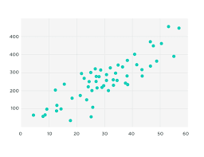
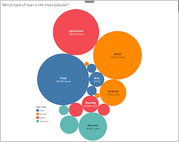
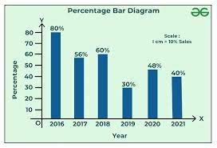
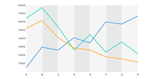
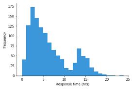
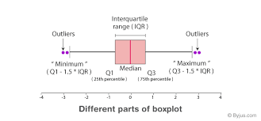
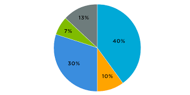
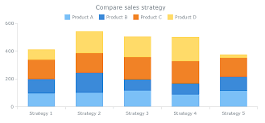
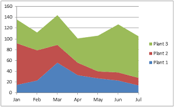

# For high level catagories

1. Relationship

    - Scatter chart

        scatter plot demonstrates the relationship between two variables (X,Y)

        

    - Bubble chart

        bubble chart demonstrates the relationship between three variables (X,Y,Bubble Size)

        

2. Comparisons

    - Bar chart
        

    - Line chart
        

3. Distributions

    - histograms
        

    - box plot
        

4. Compositions

    - pie chart
        
    - stacked bar chart
        
    - stacked are chart
        
